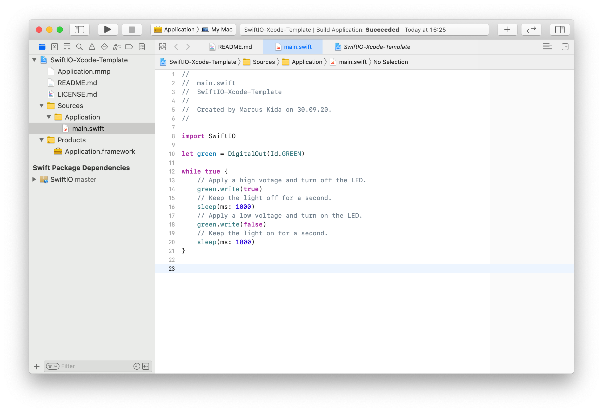
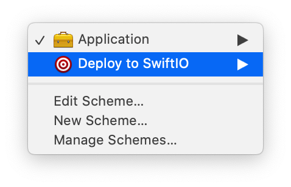

# SwiftIO Xcode Template

### A proof of concept to build a MadMachine.io Project using Xcode



#### Purpose

You can now use Xcode to write your SwiftIO programs and automatically have them deployed to your SwiftIO board once they've been built successfully.

#### Requirements

1. Make sure you've got Xcode 12 installed.
2. Make sure you've got the MadMachine IDE installed in `/Applications/MadMachine.app`.

#### Usage

1. Clone this Repository and open it using Xcode:

```
$ git clone https://github.com/kimar/SwiftIO-Xcode-Template.git && cd SwiftIO-Xcode-Template
$ open SwiftIO-Xcode-Template.xcodeproj
```

2. Put the SwiftIO board into download mode using the button.

3. Select the `Application`-Target to build the project and see if it compiles.

4. If you'd like to deploy it to your SwiftIO board, just select the `Deploy to SwiftIO`-Target, hit `Cmd + B` and the Project will compile, when it's done compiling it will figure out the path to your microSD card and deploy it there. **WARNING**: an exsiting `swiftio.bin` on your microSD will be overwritten.



4. The board will reboot automatically and hopefully run your program! 🎉 
